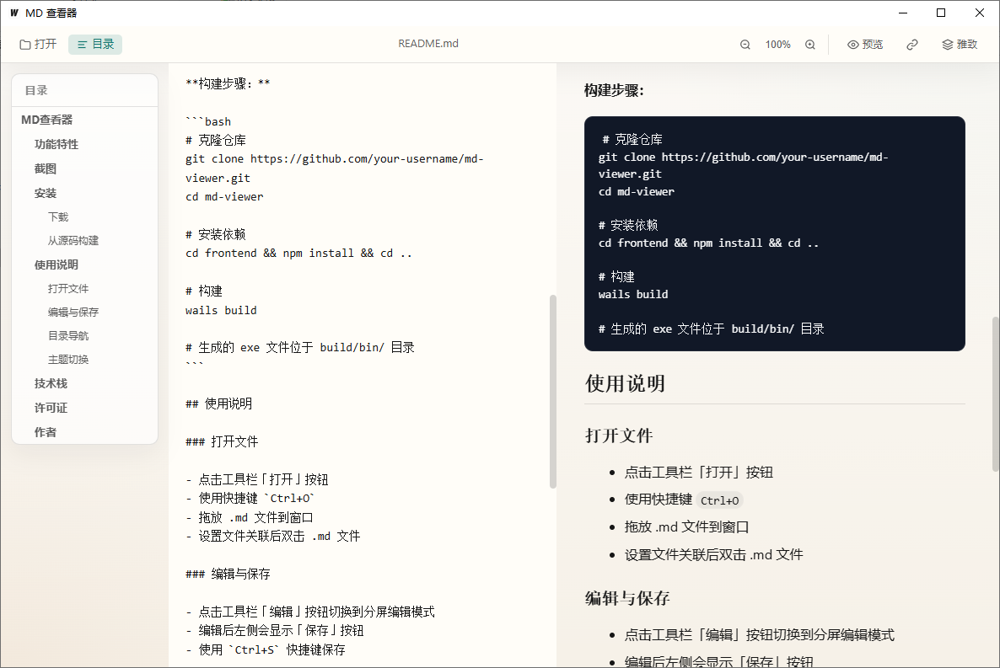
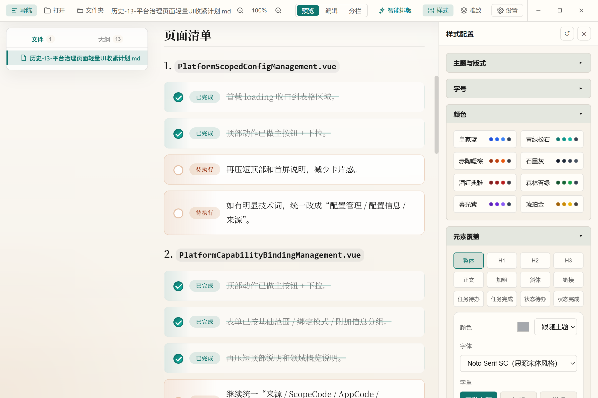
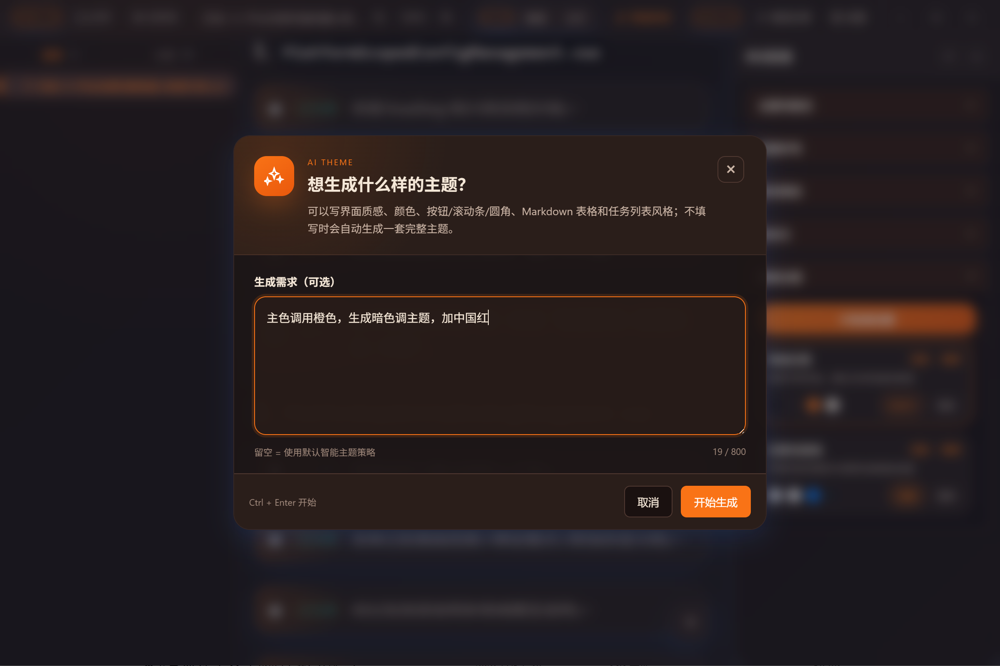
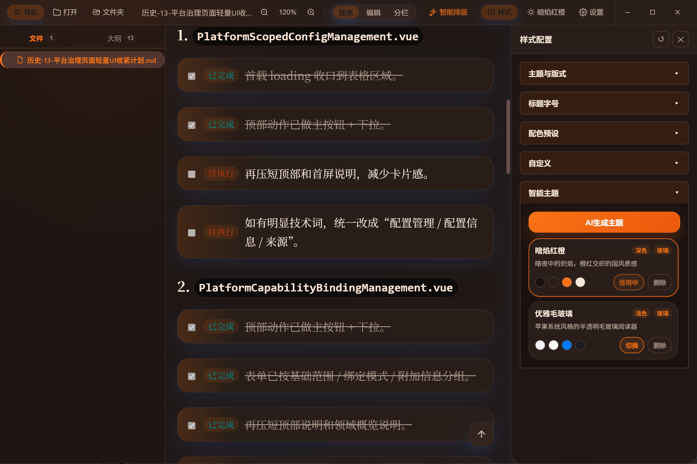
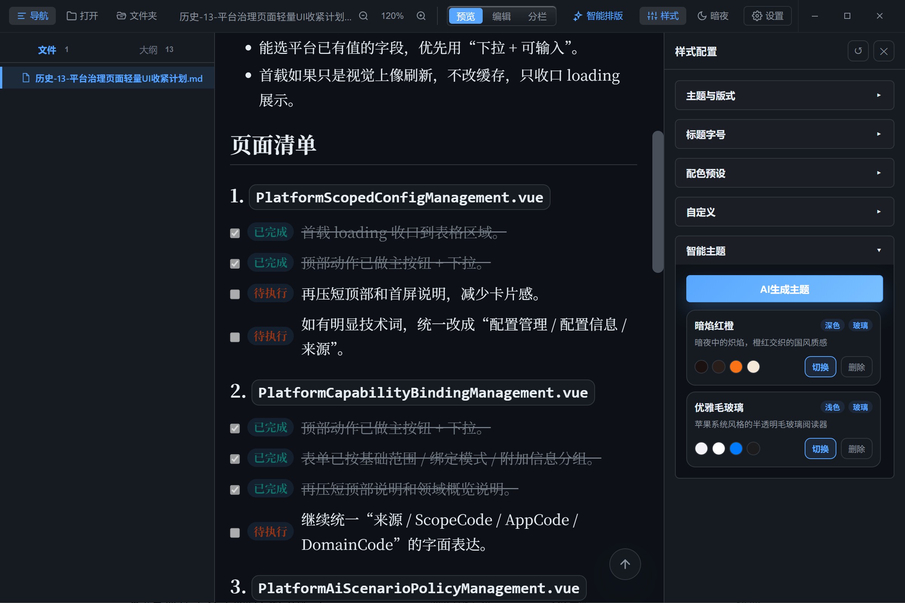
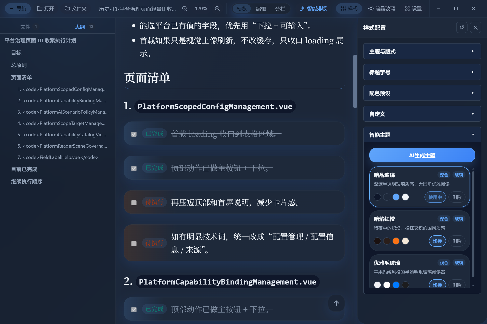

# MD查看器

一款轻量级的 Markdown、纯文本与轻量 HTML 设计整理工具，基于 Wails (Go + Vue 3) 构建。当前版本 `v1.0.3`，详细更新见 [docs/更新日志.md](docs/更新日志.md)。

## 功能特性

| 功能 | 说明 |
| --- | --- |
| <strong><big>三种工作模式</big></strong> | 支持 `预览 / 编辑 / 分栏` 三种模式，阅读、可视化编辑和源码对照修改可以按场景快速切换 |
| <strong><big>所见即所得编辑</big></strong> | `编辑` 模式提供实时可视化 Markdown 编辑能力，修改内容会同步回源文件，适合笔记、清单和文档整理 |
| <strong><big>分栏同步预览</big></strong> | `分栏` 模式支持源码与预览同屏显示、滚动同步、拖动分割线调宽，并保持 Mermaid、代码块等内容实时渲染 |
| <strong><big>右键编辑增强</big></strong> | 在编辑模式下可通过右键快速插入标题、引用、任务清单、表格、图片、代码块和 Mermaid 图表；右击 `#` 标题还可通过 `标题大纲 -> 升级 / 降级 -> 一级到六级标题` 直接调整标题等级 |
| <strong><big>多文件与文件夹工作区</big></strong> | 支持打开单文件、多个文件或整个文件夹，适合按目录浏览和整理一组 Markdown / 文本资料 |
| <strong><big>文件树与文档大纲导航</big></strong> | 左侧同时提供文件树和 Markdown 大纲，支持快速跳转、目录展开收起和常用侧栏状态记忆 |
| <strong><big>广泛文本格式支持</big></strong> | 除 Markdown 外，也支持 TXT、日志、配置、代码等常见文本文件，并兼容多种中文编码 |
| <strong><big>外部文件自动同步与冲突保护</big></strong> | 文件被其他编辑器改动后可自动同步最新内容；若本地未保存修改与外部变更冲突，会进入冲突处理流程 |
| <strong><big>Markdown 渲染与内容增强</big></strong> | 支持代码高亮、Mermaid 图表、相对路径图片解析、任务清单强化显示，以及表格展示增强 |
| <strong><big>AI 排版与内容辅助</big></strong> | 内置多供应商、多模型配置与测试能力，可对 Markdown / HTML 执行 AI 排版，并支持部分右键插入项直接走 AI 生成 |
| <strong><big>HTML 设计器与导出</big></strong> | 内置可视化 HTML 设计器，可对页面结构做调整、执行 AI 优化，并导出当前设计结果 |
| <strong><big>主题、字体与样式系统</big></strong> | 支持内置主题、AI 智能主题、外置字体和细粒度样式配置，可调整排版、圆角、表格、任务清单等显示细节 |
| <strong><big>界面缩放与状态记忆</big></strong> | 支持正文缩放、`Ctrl + 鼠标滚轮` 整体界面缩放，并可保存主题、模式、导航栏宽度等常用状态 |
| <strong><big>桌面应用体验优化</big></strong> | 基于 Wails 构建，支持拖拽打开、快捷键操作、窗口控制和更贴近原生桌面的文件工作流 |

## 截图









## 安装

### 下载

前往 [Releases](https://github.com/qizhenghai2020/mdview/releases) 页面下载最新版本。

### 从源码构建

**前置要求：**
- Go 1.18+
- Node.js 16+
- Wails CLI (`go install github.com/wailsapp/wails/v2/cmd/wails@latest`)

**构建步骤：**

```bash
# 克隆仓库
git clone https://github.com/qizhenghai2020/mdview.git
cd mdview

# 安装依赖
cd frontend && npm install && cd ..

# 构建
wails build

# 生成的 exe 文件位于 build/bin/ 目录
```

## 使用说明

### 打开文件

- 点击工具栏「打开」按钮选择一个或多个文本文件
- 点击工具栏「文件夹」按钮打开包含多层目录的文本项目
- 使用快捷键 `Ctrl+O`
- 拖放一个或多个文本文件，或直接拖入文件夹
- 设置文件关联后双击 .md 文件

### 编辑与保存

- 点击工具栏中的 `预览 / 编辑 / 分栏` 标签切换工作模式
- `编辑` 模式适合可视化实时修改，`分栏` 模式适合对照源码与预览同步调整
- 内容修改后顶部会显示「保存」按钮
- 使用 `Ctrl+S` 快捷键保存

### 右键编辑增强

- 在 `编辑` 或 `分栏` 模式下，可通过右键菜单快速插入标题、引用、任务清单、表格、图片、代码块和 Mermaid 图表
- 右击 Markdown 标题时，可使用 `标题大纲 -> 升级 / 降级 -> 一级标题到六级标题`，直接把当前标题改到目标等级
- 代码块、Mermaid、任务清单、表格等部分右键项支持“新增”与“AI 生成”两种入口

### 文件与大纲导航

- 点击工具栏「导航」按钮显示/隐藏左侧栏
- 左侧「文件」页签可展开或收起文件夹，点击文件立即切换当前内容
- Markdown 文档可切换到「大纲」页签，点击标题跳转到对应章节
- 拖动目录边框调整宽度

### 主题与样式

- 点击工具栏右侧主题按钮可快速切换当前主题
- 设置与样式面板支持调整主题、字体、圆角、表格显示、任务清单样式等细节
- 可使用内置主题、AI 主题，以及放在 exe 同目录 `fonts` 文件夹中的外置字体

## 技术栈

- **后端**: Go + Wails v2
- **前端**: Vue 3 + Vite
- **Markdown 解析**: marked
- **代码高亮**: highlight.js
- **图表渲染**: mermaid

## 许可证

[Apache License 2.0](LICENSE)

## 作者
qizhenghai
