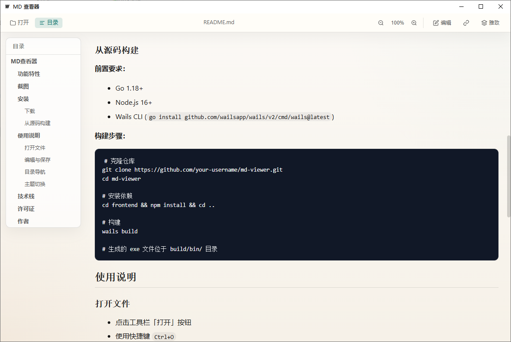

# MD查看器

一款轻量级的 Markdown 文档查看器，基于 Wails (Go + Vue 3) 构建。

## 功能特性

- **实时预览** - 支持 Markdown 实时渲染
- **分屏编辑** - 编辑与预览同屏显示，支持滚动同步
- **目录导航** - 自动生成文档目录，支持点击跳转
- **多主题切换** - 内置亮色、暗色、雅致三种主题
- **代码高亮** - 支持多种编程语言语法高亮
- **图表渲染** - 支持 Mermaid 流程图、时序图等
- **图片支持** - 自动解析相对路径图片
- **文件关联** - 可设置为 .md 文件默认打开程序
- **缩放功能** - 支持 50%-200% 内容缩放
- **快捷键** - Ctrl+O 打开文件，Ctrl+S 保存

## 截图




## 安装

### 下载

前往 [Releases](https://github.com/qizhenghai2020/md-viewer/releases) 页面下载最新版本。

### 从源码构建

**前置要求：**
- Go 1.18+
- Node.js 16+
- Wails CLI (`go install github.com/wailsapp/wails/v2/cmd/wails@latest`)

**构建步骤：**

```bash
# 克隆仓库
git clone https://github.com/qizhenghai2020/md-viewer.git
cd md-viewer

# 安装依赖
cd frontend && npm install && cd ..

# 构建
wails build

# 生成的 exe 文件位于 build/bin/ 目录
```

## 使用说明

### 打开文件

- 点击工具栏「打开」按钮
- 使用快捷键 `Ctrl+O`
- 拖放 .md 文件到窗口
- 设置文件关联后双击 .md 文件

### 编辑与保存

- 点击工具栏「编辑」按钮切换到分屏编辑模式
- 编辑后左侧会显示「保存」按钮
- 使用 `Ctrl+S` 快捷键保存

### 目录导航

- 点击工具栏「目录」按钮显示/隐藏目录侧边栏
- 拖动目录边框调整宽度
- 点击目录项跳转到对应章节

### 主题切换

点击工具栏右侧主题按钮，循环切换：
- **亮色主题** - 经典白色背景
- **暗色主题** - 深色护眼模式
- **雅致主题** - 仿纸质阅读体验

## 技术栈

- **后端**: Go + Wails v2
- **前端**: Vue 3 + Vite
- **Markdown 解析**: marked
- **代码高亮**: highlight.js
- **图表渲染**: mermaid

## 许可证

[MIT License](LICENSE)

## 作者
qizhenghai